# Speaches Integration Guide

Complete guide for setting up self-hosted transcription with [Speaches](https://github.com/speaches-ai/speaches).

## Why Speaches?

<div class="grid cards" markdown>

- 💰 **Zero Cost**

  ---

  No API fees - unlimited transcriptions for free

- 🔒 **Complete Privacy**

  ---

  100% offline - audio never leaves your machine

- ⚡ **Same Speed**

  ---

  Base model performs identically to OpenAI (3.7s vs 3.8s)

- 🎯 **High Accuracy**

  ---

  91-100% text similarity with OpenAI depending on model

</div>

## Quick Setup

!!! success "Ready in 5 Minutes"
    Set up your own self-hosted transcription server in just 3 Docker commands. No API keys, no usage limits!

### Step 1: Create Docker Compose File

Create `docker-compose.speaches.yml`:

```yaml
services:
  speaches:
    image: ghcr.io/speaches-ai/speaches:latest-cpu
    ports:
      - "8000:8000"
    volumes:
      - ./hf-cache:/home/ubuntu/.cache/huggingface/hub
    environment:
      - STT_MODEL_TTL=-1  # Keep model in memory
      - WHISPER__INFERENCE_DEVICE=cpu
      - WHISPER__COMPUTE_TYPE=int8
      - WHISPER__CPU_THREADS=8
    healthcheck:
      test: [ "CMD", "curl", "-f", "http://localhost:8000/health" ]
```

### Step 2: Start Speaches

```bash
docker compose -f docker-compose.speaches.yml up -d
```

**First startup**: Downloads model (~140MB for base) - takes 1-2 minutes

### Step 3: Configure Voice Transcriber

Edit config:

```bash
nano ~/.config/voice-transcriber/config.json
```

Update:

```json
{
  "language": "fr",
  "formatterEnabled": false,
  "transcription": {
    "backend": "speaches",
    "speaches": {
      "url": "http://localhost:8000/v1",
      "apiKey": "none",
      "model": "Systran/faster-whisper-base"
    }
  }
}
```

### Step 4: Restart Application

```bash
# Restart Voice Transcriber
voice-transcriber
```

✅ **Done!** First transcription will auto-download the model.


*Speaches running locally with Docker showing health check status*

## Security & Authentication

### Local Development (No API Key)

For **local-only usage**, you can run Speaches without authentication:

```yaml
services:
  speaches:
    environment:
      # No API_KEY variable = open access
      - STT_MODEL_TTL=-1
      - WHISPER__INFERENCE_DEVICE=cpu
```

```json
{
  "transcription": {
    "backend": "speaches",
    "speaches": {
      "url": "http://localhost:8000/v1",
      "apiKey": "none",
      "model": "Systran/faster-whisper-base"
    }
  }
}
```

!!! warning "Security Risk"
    Running without authentication is **only safe for localhost**. Never expose an unauthenticated Speaches instance to a network.

### Self-Hosted with API Key (Recommended)

For **remote access** or **VPS deployment**, secure your Speaches instance with an API key:

#### Step 1: Generate Secure API Key

```bash
# Generate a 32-byte random key
openssl rand -hex 32
```

Example output: `QpJhqVNdqPbNiPxHkAB6CztKvRkTLKxj`

#### Step 2: Configure Speaches with API Key

Update `docker-compose.speaches.yml`:

```yaml
services:
  speaches:
    image: ghcr.io/speaches-ai/speaches:latest-cpu
    ports:
      - "8000:8000"
    volumes:
      - ./hf-cache:/home/ubuntu/.cache/huggingface/hub
    environment:
      - API_KEY=<API_KEY>  # Your secure key
      - STT_MODEL_TTL=-1
      - WHISPER__INFERENCE_DEVICE=cpu
      - WHISPER__COMPUTE_TYPE=int8
      - WHISPER__CPU_THREADS=8
    healthcheck:
      test: [ "CMD", "curl", "-f", "http://localhost:8000/health" ]
```

#### Step 3: Configure Voice Transcriber

Update `~/.config/voice-transcriber/config.json`:

```json
{
  "language": "fr",
  "formatterEnabled": false,
  "transcription": {
    "backend": "speaches",
    "speaches": {
      "url": "http://your-server.com:8000/v1",
      "apiKey": "<API_KEY>",
      "model": "Systran/faster-whisper-base"
    }
  }
}
```

!!! success "Production Ready"
    With API key authentication, your Speaches instance is secure for remote access and shared usage.

### Best Practices

**API Key Management**:
- ✅ Use `openssl rand -hex 32` to generate cryptographically secure keys
- ✅ Store keys in environment variables or secret management systems
- ✅ Rotate keys periodically (every 3-6 months)
- ✅ Use different keys for different environments (dev, staging, prod)
- ❌ Never commit API keys to version control
- ❌ Never share keys in public channels or documentation

**Network Security**:
- Use HTTPS with reverse proxy (Traefik, Nginx, Caddy) for production
- Restrict firewall rules to known IP addresses when possible
- Monitor access logs for suspicious activity
- Consider VPN access for sensitive deployments

**Example with HTTPS (Traefik)**:

```yaml
# docker-compose.speaches-prod.yml
version: '3.8'

services:
  traefik:
    image: traefik:v2.10
    command:
      - "--api.insecure=false"
      - "--providers.docker=true"
      - "--entrypoints.web.address=:80"
      - "--entrypoints.websecure.address=:443"
      - "--certificatesresolvers.letsencrypt.acme.tlschallenge=true"
      - "--certificatesresolvers.letsencrypt.acme.email=your-email@example.com"
      - "--certificatesresolvers.letsencrypt.acme.storage=/letsencrypt/acme.json"
    ports:
      - "80:80"
      - "443:443"
    volumes:
      - /var/run/docker.sock:/var/run/docker.sock:ro
      - ./letsencrypt:/letsencrypt
    networks:
      - speaches

  speaches:
    image: ghcr.io/speaches-ai/speaches:latest-cpu
    environment:
      - API_KEY=${SPEACHES_API_KEY}
      - STT_MODEL_TTL=-1
      - WHISPER__INFERENCE_DEVICE=cpu
      - WHISPER__COMPUTE_TYPE=int8
      - WHISPER__CPU_THREADS=8
    volumes:
      - ./hf-cache:/home/ubuntu/.cache/huggingface/hub
    labels:
      - "traefik.enable=true"
      - "traefik.http.routers.speaches.rule=Host(`speaches.yourdomain.com`)"
      - "traefik.http.routers.speaches.entrypoints=websecure"
      - "traefik.http.routers.speaches.tls.certresolver=letsencrypt"
      - "traefik.http.services.speaches.loadbalancer.server.port=8000"
    networks:
      - speaches

networks:
  speaches:
    driver: bridge
```

**.env file**:
```bash
SPEACHES_API_KEY=your-secure-api-key-here
```

**Deploy with Traefik**:
```bash
# Create .env file with your API key
echo "SPEACHES_API_KEY=$(openssl rand -hex 32)" > .env

# Start services
docker compose -f docker-compose.speaches-prod.yml up -d
```

**Voice Transcriber Configuration**:
```json
{
  "transcription": {
    "backend": "speaches",
    "speaches": {
      "url": "https://speaches.yourdomain.com/v1",
      "apiKey": "your-secure-api-key-here",
      "model": "Systran/faster-whisper-base"
    }
  }
}
```

## Available Models

| Model        | Size   | Memory  | Speed | Accuracy | Use Case         |
|--------------|--------|---------|-------|----------|------------------|
| **tiny**     | 75 MB  | ~273 MB | ⚡⚡⚡   | ⭐⭐       | Quick testing    |
| **base** ⭐   | 142 MB | ~388 MB | ⚡⚡    | ⭐⭐⭐      | **Recommended**  |
| **small**    | 466 MB | ~852 MB | ⚡     | ⭐⭐⭐⭐     | Better accuracy  |
| **medium**   | 1.5 GB | ~2.1 GB | 🐢    | ⭐⭐⭐⭐⭐    | High accuracy    |
| **large-v3** | 2.9 GB | ~3.9 GB | 🐢🐢  | ⭐⭐⭐⭐⭐    | Maximum accuracy |

!!! success "Recommendation: Base Model"
- Comparable speed to OpenAI (0.97x)
- 91% accuracy - excellent for daily use
- Low resource usage (~400MB RAM)
- Zero cost

## Performance Comparison

**Benchmark**: 30s French audio, Remote server (8 CPU / 8GB RAM)

```mermaid
graph LR
subgraph "OpenAI Whisper ☁️"
O1[Upload<br/>~1s]
O2[Process<br/>2-4s]
O3[Download<br/>~0.5s]
O1 --> O2 --> O3
end

subgraph "Speaches Local 🏠"
S1[No Upload<br/>0s]
S2[Process<br/>2-4s]
S3[No Download<br/>0s]
S1 --> S2 -->S3
end

style O1 fill: #FFE4B5
style O2 fill: #87CEEB
style O3 fill: #FFE4B5
style S1 fill: #90EE90
style S2 fill: #87CEEB
style S3 fill: #90EE90
```



**Real-World Performance Benchmark:**

| Model        | OpenAI Whisper | Speaches (CPU) | Speed Ratio            | Text Similarity |
|--------------|----------------|----------------|------------------------|-----------------|
| **tiny**     | 1.98s          | 2.81s          | **0.70x** (comparable) | 92.4%           |
| **base** ⭐   | 3.70s          | 3.81s          | **0.97x** (comparable) | 91.4%           |
| **small**    | 2.23s          | 7.15s          | 0.31x (3x slower)      | 97.4%           |
| **medium**   | 3.70s          | 25.82s         | 0.14x (7x slower)      | 96.1%           |
| **large-v3** | 2.55s          | 30.80s         | 0.08x (12x slower)     | 100.0%          |

**Key Insights:**

- **Base model**: Nearly identical speed to OpenAI (0.97x), 91% accuracy - **best for daily use**
- **Small model**: Excellent 97% accuracy, acceptable 3x slowdown
- **Medium/Large**: Maximum quality (96-100%) but significantly slower (7-12x)

**Recommendations:**

- **For speed & cost**: Use `base` model - nearly identical speed to OpenAI, 91% accuracy, zero cost
- **For accuracy**: Use `small` model - excellent 97% accuracy, acceptable 3x slower
- **For maximum quality**: Use `medium` or `large-v3` - 96-100% accuracy but significantly slower (7-12x)

!!! note "Performance Context"
Performance tested on remote server (8 CPU cores, 8GB RAM). GPU acceleration would significantly improve medium/large
model speeds (5-10x faster). Tiny and base models are CPU-optimized and run efficiently without GPU.

## Changing Models

Edit config to use different model:

```json
{
  "transcription": {
    "backend": "speaches",
    "speaches": {
      "model": "Systran/faster-whisper-small"
    }
  }
}
```

**Available models**:

- `Systran/faster-whisper-tiny`
- `Systran/faster-whisper-base` ⭐
- `Systran/faster-whisper-small`
- `Systran/faster-whisper-medium`
- `Systran/faster-whisper-large-v3`

**Restart application** for changes to take effect.

## GPU Acceleration

For significantly faster processing with medium/large models:

```yaml
services:
  speaches:
    image: ghcr.io/speaches-ai/speaches:latest-cuda  # GPU image
    runtime: nvidia
    environment:
      - WHISPER__INFERENCE_DEVICE=cuda
      - WHISPER__COMPUTE_TYPE=float16
```

**Requirements**: NVIDIA GPU with CUDA support

## Troubleshooting

### Model Download Fails

```bash
# Check logs
docker compose -f docker-compose.speaches.yml logs -f speaches
```

**Solution**: Ensure internet connection for initial download

### Service Not Responding

```bash
# Check health
curl http://localhost:8000/health

# Restart service
docker compose -f docker-compose.speaches.yml restart
```

### Out of Memory

**Solution**: Use smaller model or increase Docker memory limit

```yaml
services:
  speaches:
    deploy:
      resources:
        limits:
          memory: 4G  # Increase memory
```

## Advanced Configuration

### Custom Whisper Parameters

```yaml
environment:
  - WHISPER__BEAM_SIZE=5
  - WHISPER__BEST_OF=5
  - WHISPER__TEMPERATURE=0.0
```

### Remote Speaches Server

Run Speaches on a VPS and connect remotely:

```json
{
  "transcription": {
    "backend": "speaches",
    "speaches": {
      "url": "https://your-server.com/v1",
      "apiKey": "your-api-key",
      "model": "Systran/faster-whisper-base"
    }
  }
}
```

## Cost Comparison

**OpenAI Whisper**:

- $0.006 per minute
- 100 hours = $36/month
- No local resources needed

**Speaches (Self-Hosted)**:

- $0 transcription cost
- VPS: ~$5-10/month (optional)
- Requires local/VPS resources

!!! success "Break-Even Point"
After ~100 hours of transcription, Speaches becomes more cost-effective than OpenAI.

## Next Steps

- [Whisper Models Comparison](whisper-models.md) - Detailed model benchmarks
- [Transcription Backends](../user-guide/transcription-backends.md) - Backend comparison
- [Configuration Guide](../getting-started/configuration.md) - Advanced settings

---

!!! question "Need Help?"
- [Speaches Documentation](https://github.com/speaches-ai/speaches)
- [Voice Transcriber Issues](https://github.com/Nouuu/voice-transcriber/issues)
