# Voice Transcriber - Technical Architecture

## Overview

Voice Transcriber is a lightweight desktop application that provides seamless voice-to-text conversion with system tray integration. The application follows a service-oriented architecture with clear separation of concerns and minimal dependencies.

## Core Architecture Principles

### 1. Simplicity First
- Each service has 3-5 core methods maximum
- Simple interfaces: `{ success: boolean, error?: string }`
- No overengineering or complex retry logic
- Console logging only (info/error levels)

### 2. Service-Oriented Design
- Clear separation of concerns
- Dependency injection for testability
- Consistent error handling patterns
- Graceful degradation when services fail

### 3. User-Centric Approach
- First-run setup wizard
- Visual feedback via system tray states
- Automatic clipboard integration
- Multilingual support (French/English auto-detection)

## System Components

```
┌─────────────────────────────────────────────────────┐
│                Main Application                     │
│            (VoiceTranscriberApp)                    │
└─────────────────┬───────────────────────────────────┘
                  │
        ┌─────────┼─────────┐
        │         │         │
        ▼         ▼         ▼
┌─────────────┐ ┌─────────────┐ ┌─────────────────┐
│   System    │ │    Audio    │ │   Configuration │
│    Tray     │ │  Recording  │ │     Service     │
│   Service   │ │   Service   │ │                 │
└─────────────┘ └─────────────┘ └─────────────────┘
        │                              │
        ▼                              ▼
┌─────────────┐                ┌─────────────────┐
│  Clipboard  │                │  OpenAI API     │
│   Service   │                │   Services      │
└─────────────┘                │                 │
                               │ ┌─────────────┐ │
                               │ │Transcription│ │
                               │ │   Service   │ │
                               │ └─────────────┘ │
                               │ ┌─────────────┐ │
                               │ │ Formatter   │ │
                               │ │   Service   │ │
                               │ └─────────────┘ │
                               └─────────────────┘
```

## Service Descriptions

### Main Application (`src/index.ts`)
**Purpose**: Central orchestrator that manages all services and application lifecycle.

**Key Responsibilities**:
- Service initialization and dependency injection
- Event handling and workflow coordination
- Error management and recovery
- Graceful shutdown handling

**State Machine**:
```
IDLE → RECORDING → PROCESSING → IDLE
  ↑                              ↓
  └──────────── ERROR ←──────────┘
```

### System Tray Service (`src/services/system-tray.ts`)
**Purpose**: Manages system tray integration with visual state feedback.

**Features**:
- Three visual states with distinct icons:
  - 🟢 IDLE: Green circle (ready to record)
  - 🔴 RECORDING: Red circle (actively recording)
  - 🟣 PROCESSING: Purple circle (transcribing audio)
- Click-to-record functionality
- Context menu with Start/Stop/Exit options
- Cross-platform icon compatibility (Base64 encoded)

**Icon Management**:
- Icons embedded as Base64 strings for npm distribution
- Automatic menu state updates based on recording status
- Workaround for node-systray-v2 double icon issues

### Audio Recording Service (`src/services/audio-recorder.ts`)
**Purpose**: Handles system audio capture using Linux arecord.

**Features**:
- Spawns arecord process for high-quality audio capture
- Temporary file management in system temp directory
- Process lifecycle management (start/stop/cleanup)
- CD-quality WAV format (44.1kHz, 16-bit)

**System Dependencies**:
```bash
# Required for audio recording
sudo apt-get install alsa-utils
```

### Transcription Service (`src/services/transcription.ts`)
**Purpose**: Converts audio files to text using OpenAI Whisper API.

**Features**:
- Automatic language detection (French/English mixed speech)
- Enhanced prompting for preserving original language structure
- Technical term preservation in mixed-language contexts
- Robust error handling for API failures

**Configuration**:
```typescript
{
  apiKey: string;           // OpenAI API key
  language?: string;        // Auto-detect if undefined
  prompt?: string;          // Custom transcription prompt
}
```

### Formatter Service (`src/services/formatter.ts`)
**Purpose**: Optional text enhancement using ChatGPT API.

**Features**:
- Grammar and punctuation improvement
- Language preservation (French/English/Spanish/German/Italian)
- Configurable enable/disable
- Temperature-controlled generation (0.3 for consistency)

### Configuration Service (`src/config/config.ts`)
**Purpose**: Manages application configuration with user-friendly setup.

**Features**:
- User config directory (`~/.config/voice-transcriber/`)
- Interactive first-run setup wizard
- API key validation and storage
- JSON-based configuration file

**Config Location**:
```
~/.config/voice-transcriber/config.json
```

### Clipboard Service (`src/services/clipboard.ts`)
**Purpose**: Cross-platform clipboard operations.

**Features**:
- Automatic text copying after transcription
- Cross-platform compatibility (Linux/Windows/macOS)
- Simple success/error feedback

## Data Flow

### Recording Workflow

```mermaid
sequenceDiagram
    actor User
    participant Tray as System Tray
    participant Audio as Audio Recorder
    participant MP3 as MP3 Encoder
    participant Trans as Transcription
    participant Format as Formatter
    participant Clip as Clipboard

    User->>Tray: Click icon
    Tray->>Tray: State → RECORDING
    Tray->>Audio: Start recording
    Audio->>Audio: Spawn arecord
    Note over User,Audio: User speaks...
    User->>Tray: Click again
    Tray->>Audio: Stop recording
    Audio-->>Tray: WAV file path
    Tray->>Tray: State → PROCESSING
    Tray->>MP3: Convert WAV→MP3
    MP3-->>Tray: MP3 file (75% smaller)
    Tray->>Trans: Transcribe audio
    Trans->>Trans: Call Whisper API
    Trans-->>Tray: Transcribed text
    alt Formatter enabled
        Tray->>Format: Format text
        Format->>Format: Call GPT API
        Format-->>Tray: Formatted text
    end
    Tray->>Clip: Copy to clipboard
    Clip-->>Tray: Success
    Tray->>Tray: State → IDLE
    Tray-->>User: ✅ Ready (text in clipboard)
```



**Text-based flow**:
```
1. User clicks tray icon
   ↓
2. System tray → RECORDING state
   ↓
3. Audio recorder starts arecord process
   ↓
4. User clicks again to stop
   ↓
5. System tray → PROCESSING state
   ↓
6. Audio file saved to temp directory (WAV format)
   ↓
7. MP3 Encoder converts WAV to MP3 (~75% compression)
   ↓
8. Transcription service → Whisper API (OpenAI or Speaches)
   ↓
9. [Optional] Formatter service → ChatGPT API
   ↓
10. Clipboard service writes final text
   ↓
11. System tray → IDLE state
```

### Error Handling Flow
```
Error occurs in any service
   ↓
Service returns { success: false, error: string }
   ↓
Main application logs error
   ↓
System tray returns to IDLE state
   ↓
User can retry operation
```

## Technology Stack

### Runtime & Build
- **Development**: Bun ≥1.2.0 with TypeScript
- **Production**: Node.js ≥22 (npm distribution)
- **Build**: Bun bundler for single-file distribution
- **Package Management**: Bun for development, npm for distribution

### Core Dependencies
```json
{
  "openai": "^5.11.0",              // OpenAI API integration
  "node-systray-v2": "...",         // System tray (improved fork)
  "clipboardy": "^4.0.0"            // Cross-platform clipboard
}
```

### System Requirements
- **Linux**: Ubuntu 22.04+ with alsa-utils and xsel
- **Audio**: ALSA-compatible sound system
- **Desktop**: System tray support (GNOME, KDE, XFCE)

## Performance Characteristics

### Memory Usage
- **Base**: ~50MB (Node.js runtime + dependencies)
- **Recording**: +10MB (audio buffer)
- **Processing**: +20MB (API requests/responses)

### API Usage
- **Whisper**: ~$0.006 per minute of audio
- **GPT-3.5-turbo**: ~$0.002 per transcription formatting
- **Rate Limits**: Respects OpenAI API limits (no built-in retry)

### File System
- **Temp Files**: Created in `/tmp/transcriber/`
- **Config**: Stored in `~/.config/voice-transcriber/`
- **Cleanup**: Automatic temp file cleanup on process exit

## Security Considerations

### API Key Management
- Config file permissions: 600 (user read/write only)
- API key validation on startup
- No API key logging or exposure

### Audio Privacy
- Local audio processing only
- Temporary files cleaned up automatically
- No persistent audio storage

### System Integration
- Minimal system permissions required
- No elevated privileges needed
- Sandboxed execution environment

## Testing Strategy

### Test Coverage
- **Unit Tests**: 37 tests across all services
- **Integration Tests**: Full workflow validation
- **Mock Strategy**: Simple mocks for external dependencies

### Test Categories
```typescript
// Service Tests
AudioRecorder.test.ts     // Recording lifecycle
TranscriptionService.test.ts  // API integration
SystemTrayService.test.ts // UI state management
Config.test.ts           // Configuration handling

// Integration Tests
index.test.ts            // Full application workflow
```

### Testing Commands
```bash
make test              # Run all tests
make test-watch        # Watch mode for development
make test-file FILE=   # Run specific test file
```

## Development Workflow

### Setup
```bash
git clone <repository>
cd voice-transcriber
make install           # Install dependencies
make check-deps        # Verify system requirements
cp config.example.json config.json  # Setup config
```

### Development Loop
```bash
make dev              # Start with auto-reload
make test             # Run tests
make format-check     # Lint and format
```

### Build & Release
```bash
make build            # Build for production
make release-patch    # Create patch release
npm publish           # Publish to npm
```

## Future Architecture Considerations

### Scalability
- Plugin system for additional AI providers
- Configurable audio backends (PulseAudio, JACK)
- Multi-language prompt templates

### Platform Expansion
- Windows support (replace arecord with Windows Audio API)
- macOS support (replace arecord with Core Audio)
- Web version using WebRTC

### Performance Optimization
- Local Whisper model integration (faster-whisper)
- Audio compression before API upload
- Streaming transcription for long recordings

### Enhanced Features
- Keyboard shortcut integration (when Wayland supports it)
- Multiple output formats (Markdown, structured text)
- Batch processing capabilities

## Related Pages

- [API Reference](api-reference.md) - Complete API documentation for all services
- [Development Guide](development-guide.md) - Development workflow and best practices
- [Testing Guide](testing.md) - Testing strategies and patterns
- [Contributing Guide](../contributing.md) - How to contribute to the project
