# Voice Transcriber Documentation

<div align="center" markdown="1">

# 🎤 Voice Transcriber

Lightweight desktop voice-to-text transcription with OpenAI Whisper and system tray integration

[](https://github.com/Nouuu/voice-transcriber/actions/workflows/build.yml)
[](https://github.com/Nouuu/voice-transcriber/actions/workflows/test.yml)
[](https://github.com/Nouuu/voice-transcriber/blob/main/LICENSE)
[](https://bun.sh)
[](getting-started/quickstart.md)

</div>

---

## Overview

Voice Transcriber is a **lightweight desktop application** that provides seamless voice-to-text conversion with **system tray integration**. Record audio with a single click, and transcribed text is automatically copied to your clipboard.

<div class="grid cards" markdown>

-   :material-microphone:{ .lg .middle } **System Tray Integration**

    ---

    Click to record, visual state feedback (green=idle, red=recording, purple=processing)

-   :material-earth:{ .lg .middle } **Multilingual Support**

    ---

    French, English, Spanish, German, Italian with strong language enforcement

-   :material-robot:{ .lg .middle } **AI-Powered**

    ---

    OpenAI Whisper transcription with optional GPT text formatting

-   :material-home:{ .lg .middle } **Self-Hosted Option**

    ---

    Run 100% offline with [Speaches](https://github.com/speaches-ai/speaches) - zero cost, complete privacy

</div>

## Key Features

- **🎯 System Tray Integration**: Click to record, visual state feedback
- **🎙️ High-Quality Recording**: Audio capture using arecord on Linux
- **🌍 Multilingual Support**: French, English, Spanish, German, Italian
- **✍️ Text Formatting**: Optional GPT-based grammar improvement
- **📋 Clipboard Integration**: Automatic result copying
- **🏠 Self-Hosted Option**: Run 100% offline with Speaches
- **🔒 Privacy-Focused**: No persistent audio storage, local processing

## Quick Start

Get started in under 5 minutes:

=== "Automated Setup (Recommended)"

    ```bash
    # Clone the repository
    git clone https://github.com/Nouuu/voice-transcriber.git
    cd voice-transcriber
    
    # One-command setup (checks deps, installs, creates config)
    make setup
    
    # Configure your OpenAI API key
    nano ~/.config/voice-transcriber/config.json
    
    # Run the application
    make run
    ```

=== "Step-by-Step Setup"

    ```bash
    # Clone the repository
    git clone https://github.com/Nouuu/voice-transcriber.git
    cd voice-transcriber
    
    # Check system dependencies (Bun, arecord, xsel)
    make check-system-deps
    
    # Install Bun dependencies
    make install
    
    # Initialize configuration file
    make init-config
    
    # Configure your OpenAI API key
    nano ~/.config/voice-transcriber/config.json
    
    # Run the application
    make run
    ```

!!! tip "Next Steps"
    - [⚡ Quickstart](getting-started/quickstart.md) - Get started in 5 minutes
    - [Installation Guide](getting-started/installation.md) - Detailed setup instructions
    - [Configuration](getting-started/configuration.md) - Configure languages and backends
    - [Basic Usage](user-guide/basic-usage.md) - Learn how to use the app

## How It Works

```mermaid
sequenceDiagram
    participant User
    participant SystemTray
    participant AudioRecorder
    participant MP3Encoder
    participant Backend as Whisper API<br/>(OpenAI or Speaches)
    participant GPT as ChatGPT<br/>(optional)
    participant Clipboard

    User->>SystemTray: Click tray icon
    SystemTray->>SystemTray: State: RECORDING (🔴)
    SystemTray->>AudioRecorder: Start recording
    AudioRecorder->>AudioRecorder: Capture audio (arecord)
    User->>SystemTray: Click again to stop
    SystemTray->>SystemTray: State: PROCESSING (🟣)
    AudioRecorder->>AudioRecorder: Save WAV file
    AudioRecorder->>MP3Encoder: Convert to MP3
    Note over MP3Encoder: Compress audio<br/>~75% size reduction<br/>(mono 16kHz 64kbps)
    MP3Encoder-->>AudioRecorder: MP3 file
    AudioRecorder->>Backend: Upload MP3
    Backend->>Backend: Transcribe audio
    Backend-->>AudioRecorder: Return text
    opt Formatting Enabled
        AudioRecorder->>GPT: Format text
        GPT-->>AudioRecorder: Formatted text
    end
    AudioRecorder->>Clipboard: Copy text
    Clipboard-->>User: Paste transcription
    SystemTray->>SystemTray: State: IDLE (🟢)
```



**Key Steps:**

1. **Audio Capture** - Records in WAV format (CD quality: 44.1kHz, 16-bit)
2. **MP3 Compression** - Converts to mono 16kHz 64kbps MP3 (~75% size reduction)
3. **Transcription** - Sends to OpenAI Whisper or self-hosted Speaches
4. **Optional Formatting** - Improves grammar/punctuation with ChatGPT (if enabled)
5. **Clipboard** - Automatically copies result for instant pasting

!!! tip "System Tray Menu"
    Right-click the tray icon to access:
    
    - **🎙️ Start Recording** - Begin voice capture
    - **⏹️ Stop Recording** - End recording and transcribe  
    - **❌ Exit** - Exit the application
    
    Menu items are automatically enabled/disabled based on current state.

## Popular Use Cases

<div class="grid cards" markdown>

-   **📝 Note Taking**

    Record meetings, lectures, or brainstorming sessions with automatic transcription

-   **💬 Message Dictation**

    Quickly dictate messages, emails, or social media posts

-   **🌐 Language Learning**

    Practice pronunciation and see transcriptions in multiple languages

-   **♿ Accessibility**

    Voice-to-text for users with typing difficulties

</div>

## Documentation Structure

<div class="grid cards" markdown>

-   [**Getting Started**](getting-started/installation.md)

    Installation, configuration, and first-run setup

-   [**User Guide**](user-guide/basic-usage.md)

    Basic usage, language support, and troubleshooting

-   [**Development**](development/architecture.md)

    Architecture, development guide, and API reference

-   [**Advanced**](advanced/speaches-integration.md)

    Self-hosted setup, whisper models, and local inference

</div>

## Community and Support

- **GitHub Repository**: [nouuu/voice-transcriber](https://github.com/Nouuu/voice-transcriber)
- **npm Package**: [voice-transcriber](https://www.npmjs.com/package/voice-transcriber)
- **Issues**: [Report a bug or request a feature](https://github.com/Nouuu/voice-transcriber/issues)
- **Discussions**: [GitHub Discussions](https://github.com/Nouuu/voice-transcriber/discussions)

## License

This project is licensed under the [MIT License](https://github.com/Nouuu/voice-transcriber/blob/main/LICENSE).

---

<div align="center">
  <p>Built with ❤️ using <a href="https://bun.sh">Bun</a>, <a href="https://www.typescriptlang.org/">TypeScript</a>, and <a href="https://platform.openai.com/">OpenAI</a></p>
</div>
